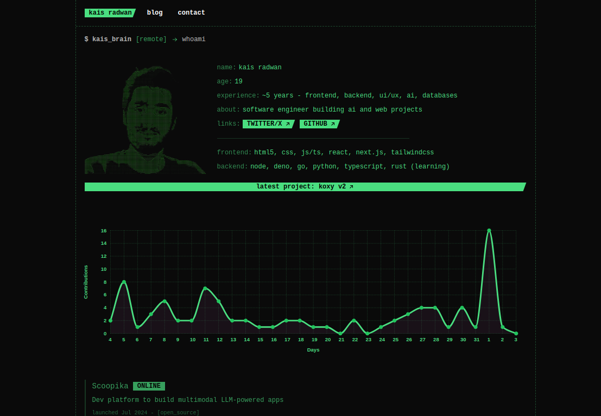

# My personal website

it shows contributions, projects, designs portfolio, and a blog.

that's it, if you like it you're welcome to clone it, just know that it uses an old version of next and some packages conflict sometimes :)

i recommend you just copy-paste some parts to your project, it's just jsx and tailwindcss after all, nothing crazy about it.